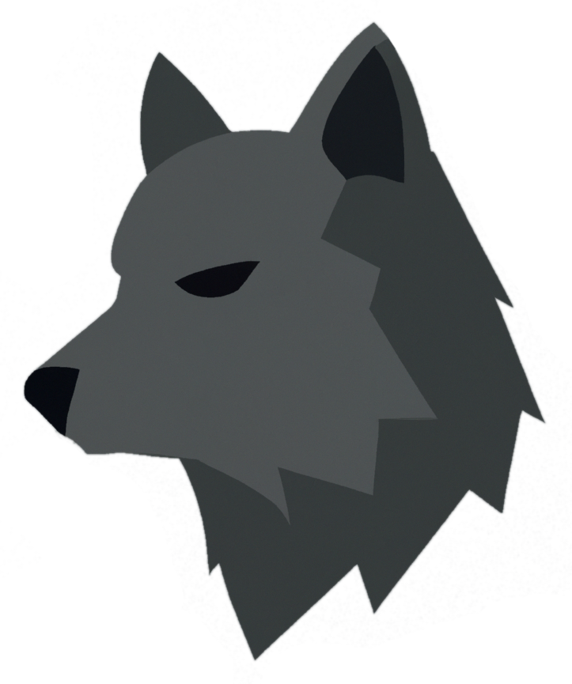

<div align="center">
  

# Werewolf.nvim


  <b>Apply custom Neovim configs based on system theme 🔆 🌑</b>
</div>

<br>


Werewolf is a handy neovim plugin that automatically changes the
theme, apply configs or run custom code depending on the system theme or
the time of day. This plugin actively listens for changes, so it can
apply configs at runtime when the system theme changes from light to
dark or vice versa, without needing to restart Neovim.

Inspired by [`werewolf.vim`][werewolf-vim].

<br>


<div align="center">
  

  <sub>
    (Term: <a href="https://github.com/alacritty/alacritty">Alacritty</a> • 
    Themes: <a href="https://github.com/marko-cerovac/material.nvim">Material</a> 
    & <a href="https://github.com/maxmx03/solarized.nvim">Solarized</a> • 
    Config: <a href="https://github.com/sheharyarn/dotfiles/blob/7a5f6ac7adde7c1d97bfb1af8d79b51904f1b364/Vim/lua/themes.lua#L77">Dotfiles</a>)
  </sub>
</div>


<br>


## Installation

**Packer:**

```lua
use 'sheharyarn/werewolf.nvim'
```

**Lazy:**

```lua
{ 'sheharyarn/werewolf.nvim', lazy = false }
```

<br>


## Configuration


## Default Options

By default, `werewolf` does not apply any custom code/theme on
system theme change or other events. Any options passed to
`setup()` will be merged with these default options before being
applied.

```lua
{
  system_theme = {
    get = require('werewolf.utils').get_theme,
    on_change = nil,
    run_on_start = true,
    period = 500,
  },
}
```


## Apply Neovim theme on system theme change

In your `init.lua`, add the following:

```lua
-- Example assumes material.nvim plugin is installed

require('werewolf').setup({
  system_theme = {
    on_change = function(theme)
      -- Apply custom config based on new `theme` value

      if theme == 'Dark' then
        vim.g.material_style = 'deep ocean'
        vim.o.background = 'dark'
        vim.cmd('colorscheme material')
      else
        vim.g.material_style = 'lighter'
        vim.o.background = 'light'
        vim.cmd('colorscheme material')
      end

    end,

    -- Change the check interval (optional)
    period = 200,
  },
})
```

If you have a more complex theme/styling configuration or want to
run additional code on system theme change events, it's better to
move that code out into separate functions and call them inside
`on_change`:

```lua
if theme == 'Dark' then
  MyUtils.dark_theme()
else
  MyUtils.light_theme()
end
```

Also [see this example][dotfiles-config] from my [dotfiles][dotfiles].


<br>


## Contributing

- [Fork][github-fork], Enhance, Send PR
- Lock issues with any bugs or feature requests
- Implement something from Roadmap
- Spread the word ❤️

<br>


## License

This package is available as open source under the terms of
the [MIT License][license-mit].

The Werewolf logo/image has been generated using OpenAI's
DALL-E and does not have any copyrights, effectively being
[CC0][license-cc0].

<br>


  [github-fork]:      https://github.com/sheharyarn/werewolf.nvim/fork
  [license-mit]:      https://opensource.org/licenses/MIT
  [license-cc0]:      https://creativecommons.org/public-domain/cc0/

  [dotfiles]:         https://github.com/sheharyarn/dotfiles
  [dotfiles-config]:  https://github.com/sheharyarn/dotfiles/blob/7a5f6ac7adde7c1d97bfb1af8d79b51904f1b364/Vim/init.lua#L54-L68

  [werewolf-vim]:     https://github.com/jonstoler/werewolf.vim
